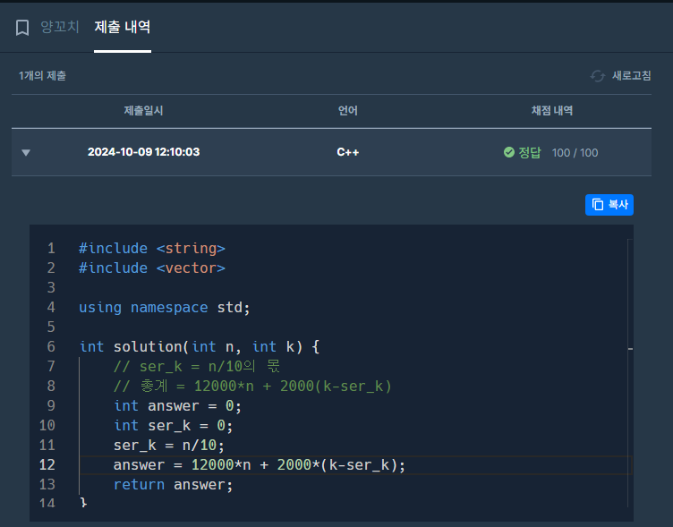

#include <string>
#include <vector>

using namespace std;

int solution(int n, int k) {  
    // ser_k = n/10의 몫  
    // 총계 = 12000*n + 2000(k-ser_k)  
    int answer = 0;  
    int ser_k = 0;  
    ser_k = n/10;  
    answer = 12000*n + 2000*(k-ser_k);  
    return answer;  
}

