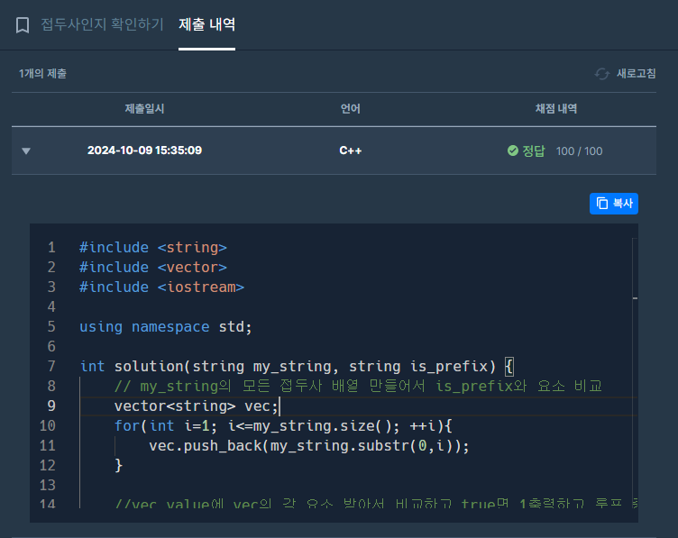

#include <string>  
#include <vector>  
#include <iostream>  

using namespace std;  

int solution(string my_string, string is_prefix) {  
    // my_string의 모든 접두사 배열 만들어서 is_prefix와 요소 비교  
    vector<string> vec;  
    for(int i=1; i<=my_string.size(); ++i){  
        vec.push_back(my_string.substr(0,i));  
    }  
      
    //vec_value에 vec의 각 요소 받아서 비교하고 true면 1출력하고 루프 종료 false면 0출력  
    for (const string& vec_value : vec) {  
        if (vec_value == is_prefix){  
            cout << 1;  
            return 1;  
        }  
    }  
    cout << 0;  
    return 0;  
}  

